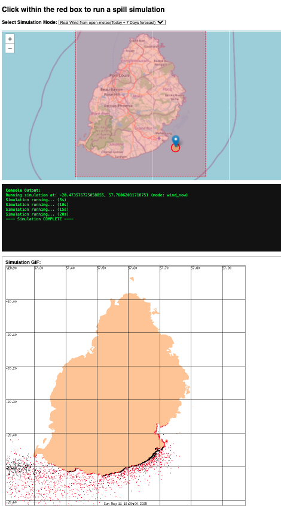

# 🛢️ Wakashio Spill Simulation Platform

A full-stack web application to simulate oil spills in the Indian Ocean using NOAA's GNOME modeling engine. Designed originally to simulate the MV Wakashio disaster near Mauritius, this platform supports:

- 🌍 **Interactive map** with Leaflet.js for selecting spill locations
- 🌬️ **Live wind forecast** integration via [Open-Meteo API](https://open-meteo.com)
- 🐚 High-resolution coastline via `.bna` files
- 🛢️ ADIOS-compatible oil types for realistic modeling
- 📈 Output formats: NetCDF (`.nc`), KMZ (`.kmz`), and animated `.gif`
- ⚙️ Flask backend with Conda-managed GNOME environment

---

## 📦 Features

| Feature                  | Description |
|--------------------------|-------------|
| **Click-to-Spill**       | Choose coordinates on the map to simulate an oil spill |
| **Wind Forecast**        | Automatically fetches 7-day forecast based on clicked location |
| **Custom Spill Logic**   | Configurable release duration, oil volume, and model duration (in progress) |
| **GNOME Integration**    | Uses `gnome.scripting` to define oceanographic movers and weatherers |
| **Simulation Outputs**   | NetCDF, KMZ, and image sequence/GIF available for download or display |
| **Modular Python Design**| Separate scripts for Wakashio using fixed data, custom, and forecasted simulations |

---

## 🗺️ Demo Interface

---

## 🧪 Requirements

- Python 3.8+
- Conda environment with GNOME (`gnome`, `pygnome`)
- Flask
- `requests`, `datetime`, `netCDF4`, `matplotlib` (if plotting)
- Access to:
  - `mauritius.bna`
  - `vlsfo-im-5-imaros_AD02592.json`

---
## Interface Screenshot



## 🚀 Quick Start

```bash
# 1. Activate GNOME environment
conda activate gnome

# 2. Run Flask backend
python app.py

# 3. Open browser at:
http://localhost:5000
